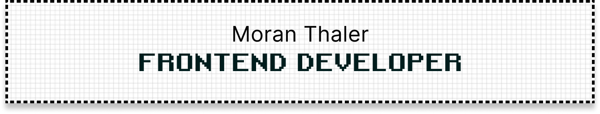

---

<h3 align="center">Connect with me on LinkedIn:  </h3>

---

 
<h2 align="center">🌐 Languages & Tools</h2>
 

 
 
 
 

---

 
<h2 align="center"> 🧑‍💻 My projects</h2>

 

 

---

 
<h2 align="center"> 🌪️ My Stats </h2>
 

